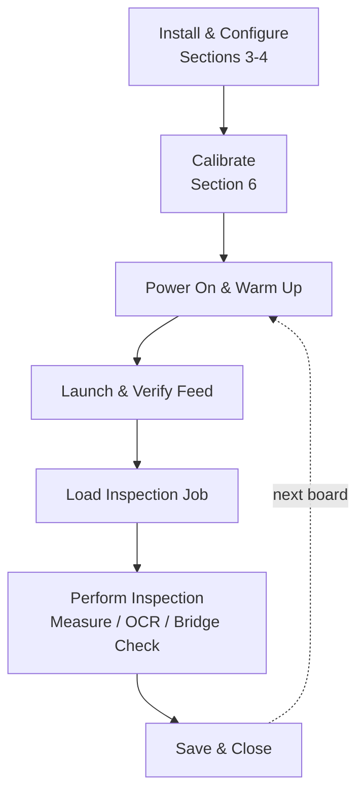

# Setting Up and Operating microcam\-benchscope for PCB Inspection

**Document Type:** Standard Operating Procedure\
**Platform/Language:** Linux (Ubuntu 22.04 / Debian 12) — Python 3.11\
**Skill Level:** Beginner–Intermediate (comfortable with the Linux command line and editing config files)\
**Last Updated:** *\[not specified in source — confirm date before publishing\]*\
**Author:** MainbyteLabs\
**Contact:** mr.mainbytelabs@gmail.com\
**Version:** 1.0\
**License:** MIT

* * *

## How to Use This Guide

This guide covers everything from a first\-time bench setup to the routine you'll follow for daily inspections. If you're setting up microcam\-benchscope for the first time, work through Sections 2 through 4 in order, then complete calibration (Section 6) before your first inspection — measurements won't be accurate until that's done. If the workstation is already installed and calibrated, skip straight to Section 5 for the daily routine, and keep Section 7 bookmarked for troubleshooting.

## Table of Contents

1. [Overview](#1-overview)
2. [Hardware Requirements](#2-hardware-requirements)
3. [Software Installation](#3-software-installation)
4. [First\-Time Setup](#4-first-time-setup)
5. [Daily Operation Procedure](#5-daily-operation-procedure)
6. [Calibration Procedure](#6-calibration-procedure)
7. [Troubleshooting](#7-troubleshooting)
8. [Maintenance](#8-maintenance)
9. [Quick Reference](#quick-reference)
10. [Appendix A — Config Reference](#appendix-a-config-reference)
11. [Appendix B — Supported Capture Card Chipsets](#appendix-b-supported-capture-card-chipsets)

## 1\. Overview

**microcam\-benchscope** is a Python\-based PCB inspection workstation application built for Linux environments. It provides a full\-featured inspection workflow around low\-cost HDMI USB capture cards (MacroSilicon chipset), digital HDMI microscopes, and USB cameras.

**Core capabilities:**

- Live HDMI and USB camera feed with real\-time image processing
- Calibrated pixel\-to\-millimeter measurement tools
- Tesseract OCR for automated chip marking and component ID extraction
- Focus stacking for extended depth\-of\-field composite images
- HDR fusion for high\-dynamic\-range board imaging
- Solder bridge candidate detection (automated flagging)
- MP4 recording of inspection sessions
- Inspection annotation and reporting utilities

**Intended users:** Electronics technicians, repair depot operators, contract PCB assemblers, and quality inspection staff working on Linux\-based benches.

**Hardware target:** MacroSilicon MS2109/MS2130 HDMI USB capture cards (widely available, sub\-$30). Standard V4L2\-compatible USB webcams are also supported.

### 1\.1 Workflow at a Glance

The diagram below shows how the one\-time setup steps feed into the routine you repeat for every board.



## 2\. Hardware Requirements

### 2\.1 Minimum System

| Component | Minimum Specification |
| --- | --- |
| OS | Ubuntu 22.04 LTS or Debian 12 (64\-bit) |
| CPU | x86\_64, quad\-core, 2.0 GHz or faster |
| RAM | 8 GB |
| Storage | 20 GB free (more if recording sessions) |
| USB | USB 3.0 port (required for full\-resolution HDMI capture) |
| Display | 1080p monitor, 24" or larger recommended |

### 2\.2 Camera / Capture Hardware

**Option A — HDMI Microscope \+ USB Capture Card (recommended)**

| Item | Notes |
| --- | --- |
| HDMI digital microscope | Any with HDMI output; 1080p preferred |
| MacroSilicon USB capture card | MS2109 or MS2130 chipset; plug\-and\-play on Linux |
| HDMI cable | Short run (1–2m) to minimize signal loss |

**Option B — USB Camera Direct**

| Item | Notes |
| --- | --- |
| USB microscope or camera | V4L2\-compatible; UVC class preferred |
| Min resolution | 1920×1080 at 30fps |

### 2\.3 Bench Setup

- Stable, vibration\-isolated surface for the microscope
- Consistent overhead or ring lighting (avoid flickering fluorescent; use LED)
- Calibration target printed or etched at known dimensions (see Section 6)

* * *

## 3\. Software Installation

### 3\.1 System Dependencies

Run as your bench user (not root):

```bash
sudo apt update && sudo apt install -y \
  python3.11 python3.11-venv python3-pip \
  v4l-utils ffmpeg \
  tesseract-ocr tesseract-ocr-eng \
  libgl1 libglib2.0-0 libsm6 libxrender1 libxext6 \
  libqt5widgets5 libqt5gui5 libqt5core5a
```

Verify V4L2 sees your capture card:

```bash
v4l2-ctl --list-devices
```

Expected output includes your capture card device node (e.g., `/dev/video0`).

### 3\.2 Clone the Repository

```bash
git clone https://github.com/BleedingCodes/microcam-benchscope.git
cd microcam-benchscope
```

### 3\.3 Create and Activate Virtual Environment

```bash
python3.11 -m venv .venv
source .venv/bin/activate
```

### 3\.4 Install Python Dependencies

```bash
pip install --upgrade pip
pip install -r requirements.txt
```

Core dependencies installed by requirements.txt:

| Package | Purpose |
| --- | --- |
| PySide6 | GUI framework |
| opencv\-python | Image processing, capture |
| PyAV | HDMI capture via FFmpeg backend |
| pytesseract | OCR (chip marking reader) |
| numpy | Array operations, image math |

### 3\.5 Verify Installation

```bash
python -c "import cv2, PySide6, av, pytesseract; print('All imports OK')"
```

Expected output: `All imports OK`

If you see an import error, confirm the relevant system dependency from Section 3.1 is installed.

* * *

## 4\. First\-Time Setup

### 4\.1 Confirm Camera Device Node

```bash
v4l2-ctl --list-devices
```

Note the `/dev/videoX` path for your capture card. This is your device node.

Check supported formats:

```bash
v4l2-ctl --device=/dev/video0 --list-formats-ext
```

Confirm 1920×1080 at 30fps is listed. If not, use the highest available resolution.

### 4\.2 Create the Configuration File

Copy the default config:

```bash
cp config/default_config.toml config/bench_config.toml
```

Open `bench_config.toml` in a text editor and set:

```toml
[camera]
device = "/dev/video0"          # Your capture card device node
width = 1920
height = 1080
fps = 30
backend = "v4l2"                # Use "pyav" for HDMI capture cards

[ocr]
enabled = true
lang = "eng"
confidence_threshold = 60       # Reject OCR results below this %

[recording]
output_dir = "/home/YOUR_USERNAME/inspection_recordings"   # Replace YOUR_USERNAME with your actual username
format = "mp4"
codec = "h264"

[calibration]
pixels_per_mm = 0.0             # Set after calibration (Section 6)
calibration_date = ""           # Set after calibration
```

### 4\.3 Verify the Live Feed

Launch the application:

```bash
source .venv/bin/activate
python main.py --config config/bench_config.toml
```

You should see the main inspection window with a live camera feed.

If the feed is black or frozen, confirm the capture card is connected to USB 3.0 (not USB 2.0) and the device node matches your config.

### 4\.4 Set Pinned Repos on BleedingCodes

> **\[Editor's note: this heading doesn't match the content below — it reads like a leftover from an unrelated step, not a description of pinning repos on BleedingCodes. The paragraph itself is a pre\-calibration reminder. Recommend confirming and renaming this heading, e.g. "4.4 Complete Calibration Before Daily Use."\]**

Before daily use begins, complete the calibration procedure (Section 6) to set `pixels_per_mm`. Measurements will not be accurate until calibration is done.

## 5\. Daily Operation Procedure

Follow this sequence every inspection session.

### Step 1 — Power On and Warm Up

1. Power on the microscope and allow 2–3 minutes for the LED illumination to stabilize.

2. Connect the HDMI capture card to USB 3.0 before launching software.

3. If recording sessions, confirm the output directory has sufficient free space:
   
   ```bash
   df -h /home/YOUR_USERNAME/inspection_recordings
   ```

### Step 2 — Launch microcam\-benchscope

```bash
cd ~/microcam-benchscope
source .venv/bin/activate
python main.py --config config/bench_config.toml
```

### Step 3 — Verify Live Feed

- Confirm the live camera feed is active and in focus.
- Adjust microscope zoom and focus to the working distance used during calibration.
- If using HDMI capture: confirm the feed is not showing a black border (adjust microscope HDMI output resolution if needed — match to your config width/height).

### Step 4 — Load or Create an Inspection Job

1. In the application, select **File → New Inspection** or **File → Open Inspection**.
2. Enter the board ID / job number.
3. Enter the inspection revision or lot number if applicable.

### Step 5 — Perform Inspection

**Measurements:**

- Click the **Measure** tool and click\-drag across the feature to measure.
- Pixel\-to\-mm conversion is applied automatically using the calibrated `pixels_per_mm` value.
- All measurements are logged to the active inspection record.

**OCR (chip marking):**

- Position the component marking in the center of the frame.
- Click **OCR → Read Marking**.
- Confirm the result — low\-confidence reads are highlighted in yellow. Re\-read or manually enter if needed.

**Solder bridge detection:**

- Click **Analyze → Detect Solder Bridges**.
- The application flags candidate regions with a red bounding box.
- Confirm or dismiss each flag — flagged regions are saved to the inspection record.

**Focus stacking (optional):**

- Used when a single focal plane cannot capture the full component depth.
- Adjust focus through the range while clicking **Focus Stack → Add Frame** at each focal plane.
- Click **Focus Stack → Merge** when done.
- The merged image is saved automatically.

**Recording (optional):**

- Click **Record → Start** to begin MP4 recording.
- Click **Record → Stop** when done. The file saves to the configured output directory.

### Step 6 — Save and Close Inspection

1. Click **File → Save Inspection**.
2. Confirm the record has saved (status bar shows last save timestamp).
3. Exit the application: **File → Exit**.

* * *

## 6\. Calibration Procedure

Calibration sets the pixel\-to\-millimeter ratio used for all on\-screen measurements. Recalibrate if the microscope zoom level changes, the capture card is replaced, or resolution settings change.

### 6\.1 Required

- A calibration target with a feature of precisely known dimensions.
  - Examples: a 1.00mm pitch IC lead, a PCB trace with known width on the fab drawing, a precision calibration slide.
- A ruler or caliper to confirm the known dimension if not already certified.

### 6\.2 Procedure

1. Place the calibration target under the microscope at your standard working distance and zoom level.

2. Launch microcam\-benchscope and open a live view.

3. Select **Calibrate → Set Reference**.

4. Click and drag across the known feature in the live image.

5. When prompted, enter the known physical dimension in millimeters (e.g., `1.00`).

6. The application calculates and displays the pixels\-per\-mm value.

7. Click **Calibrate → Save**. This writes the value to `bench_config.toml`\:
   
   ```toml
   pixels_per_mm = 47.32   # Example — your value will differ
   calibration_date = "2025-09-10"
   ```

### 6\.3 Verification

After saving:

1. Measure the same known feature using the **Measure** tool.
2. Confirm the reading matches the known dimension within ±0.05mm.
3. If outside tolerance, repeat from Step 1 above.

**Record the calibration in your bench log:** date, zoom level, known dimension used, resulting pixels\_per\_mm value.

* * *

## 7\. Troubleshooting

### 7\.1 Black or Frozen Live Feed

| Check | Action |
| --- | --- |
| Capture card in USB 3.0 port? | Move to USB 3.0. USB 2.0 is insufficient for 1080p capture. |
| Device node correct? | Run `v4l2-ctl --list-devices` and compare to `bench_config.toml`. |
| Resolution mismatch? | Set microscope HDMI output to match config width/height. |
| `backend` setting | For MacroSilicon capture cards, use `backend = "pyav"` in config. |

### 7\.2 Application Fails to Launch

```
Error: Could not initialize Qt platform plugin
```

Install missing Qt platform plugins:

```bash
sudo apt install -y libqt5xcbqpa5 libxcb-xinerama0
```

```
ModuleNotFoundError: No module named 'cv2'
```

Activate the virtual environment before launching:

```bash
source .venv/bin/activate
```

### 7\.3 OCR Returns No Result or Garbled Text

| Issue | Action |
| --- | --- |
| Chip marking out of focus | Adjust microscope focus to the marking surface |
| Marking too small in frame | Increase zoom level |
| Low contrast | Adjust lighting angle; reduce glare |
| Confidence below threshold | Lower `confidence_threshold` in config (minimum: 40) |
| Non\-English characters | Add the appropriate Tesseract language pack and update `lang` in config |

Install additional Tesseract language packs:

```bash
sudo apt install tesseract-ocr-[lang]
# Example: sudo apt install tesseract-ocr-deu  (German)
```

### 7\.4 Measurements Are Inaccurate

- Confirm `pixels_per_mm` in `bench_config.toml` is not 0.0 (requires calibration).
- Confirm zoom level has not changed since last calibration — recalibrate if it has.
- Confirm you are measuring at the same working distance used during calibration.

### 7\.5 Recording Output File Is Corrupt or Missing

- Confirm the output directory exists and is writable:
  
  ```bash
  ls -ld /home/YOUR_USERNAME/inspection_recordings
  ```

- Confirm sufficient disk space:
  
  ```bash
  df -h /home/YOUR_USERNAME/inspection_recordings
  ```

- Check for FFmpeg codec errors in the terminal output on session close.

### 7\.6 Solder Bridge Detection Produces False Positives

The detection algorithm is a candidate flagging tool — false positives are expected.

- Increase the detection threshold in **Settings → Bridge Detection → Sensitivity** (reduce sensitivity to reduce false positives).
- All flagged regions require technician confirmation before being recorded as defects.

* * *

## 8\. Maintenance

### 8\.1 Daily (End of Shift)

- [ ] Save and close all open inspection records before exiting.
- [ ] Clear any temporary files from the working directory if prompted.
- [ ] Clean the microscope lens with appropriate optics\-safe cloth if needed.
- [ ] Power off the microscope and disconnect the capture card.

### 8\.2 Weekly

- [ ] Review recording output directory — archive or delete completed session files.

- [ ] Verify calibration is still valid using the calibration verification step (Section 6.3).

- [ ] Check for application updates:
  
  ```bash
  cd ~/microcam-benchscope
  git pull origin main
  pip install -r requirements.txt
  ```

- [ ] Review the Tesseract accuracy on a sample of chip markings — reconfigure if language packs need updating.

### 8\.3 Monthly

- [ ] Full recalibration with a certified calibration target.
- [ ] Verify the bench\_config.toml calibration date reflects the last calibration.
- [ ] Check USB capture card connection — reseat if the feed has shown intermittent drops.
- [ ] Review inspection record storage — ensure backup or archive policy is current.

### 8\.4 Backup

Back up the following regularly:

| Item | Why |
| --- | --- |
| `config/bench_config.toml` | Contains calibration data |
| Inspection records directory | Audit trail |
| Recording output directory | Session evidence |

Recommended: daily rsync to a network share or external drive.

```bash
rsync -av --progress /home/YOUR_USERNAME/inspection_recordings/ /mnt/backup/inspection_recordings/
```

## Appendix A — Config Reference

| Key | Type | Default | Description |
| --- | --- | --- | --- |
| `camera.device` | string | `/dev/video0` | V4L2 device node |
| `camera.width` | int | `1920` | Capture width in pixels |
| `camera.height` | int | `1080` | Capture height in pixels |
| `camera.fps` | int | `30` | Frames per second |
| `camera.backend` | string | `v4l2` | Capture backend: `v4l2` or `pyav` |
| `ocr.enabled` | bool | `true` | Enable OCR chip marking reader |
| `ocr.lang` | string | `eng` | Tesseract language code |
| `ocr.confidence_threshold` | int | `60` | Reject OCR results below this % |
| `recording.output_dir` | string | — | Absolute path for MP4 output |
| `recording.format` | string | `mp4` | Container format |
| `recording.codec` | string | `h264` | Video codec |
| `calibration.pixels_per_mm` | float | `0.0` | Set by calibration procedure |
| `calibration.calibration_date` | string | — | ISO date of last calibration |

* * *

## Appendix B — Supported Capture Card Chipsets

| Chipset | Kernel Driver | Max Resolution | Notes |
| --- | --- | --- | --- |
| MacroSilicon MS2109 | `uvcvideo` | 1920×1080 @ 30fps | Plug\-and\-play; use `pyav` backend |
| MacroSilicon MS2130 | `uvcvideo` | 3840×2160 @ 30fps | Plug\-and\-play; use `pyav` backend |
| Generic UVC | `uvcvideo` | Varies | Use `v4l2` backend |

* * *

## Quick Reference

| Task | Command / Action |
| --- | --- |
| Activate environment | `source .venv/bin/activate` |
| Launch application | `python main.py --config config/bench_config.toml` |
| List capture devices | `v4l2-ctl --list-devices` |
| Check device formats | `v4l2-ctl --device=/dev/video0 --list-formats-ext` |
| Recalibrate | **Calibrate → Set Reference** in\-app, then **Calibrate → Save** |
| Verify calibration | Measure a known feature; must read within ±0.05mm |
| Check for updates | `git pull origin main && pip install -r requirements.txt` |
| Back up recordings | `rsync -av --progress /home/YOUR_USERNAME/inspection_recordings/ /mnt/backup/inspection_recordings/` |

**Recalibrate whenever:** zoom level changes, the capture card is replaced, or the resolution setting changes.

* * *

*Built by MainbyteLabs — technical documentation and Python tooling for electronics labs and hardware teams.*
*https://github.com/MR\-MainbyteLabs*

*Written and maintained as part of a personal technical documentation portfolio.*
